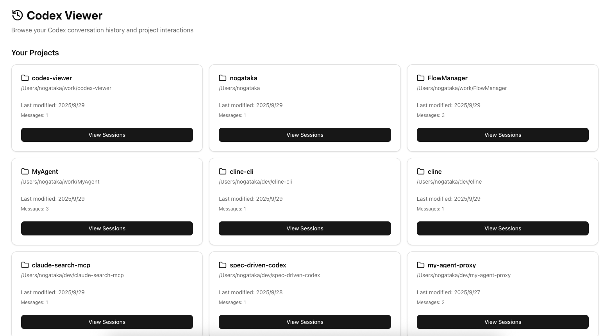
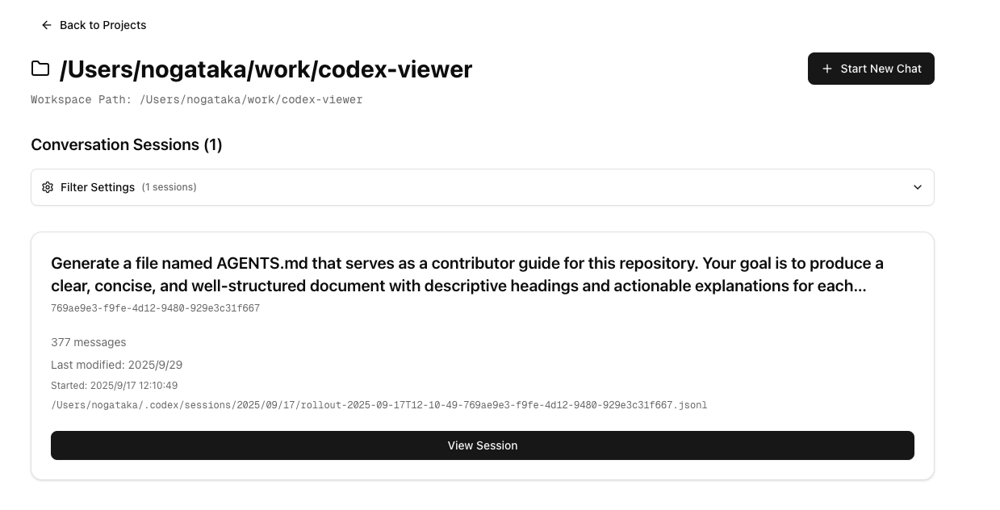
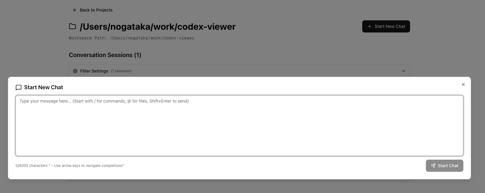

**English** | [日本語](./README.ja.md)

# ContexML

ContexML is a full-featured web client for Opencode projects. Start new conversations, resume active tasks, and review historical turns from your browser with real-time synchronization to `~/.local/share/opencode/storage/` (sessions, messages, and parts).

> **Note**: This project is a OpenCode-focused fork of [claude-code-viewer](https://github.com/d-kimuson/claude-code-viewer) by d-kimuson.







## Features

### Project Explorer
- Search projects by name or path, sort by last update / name / message count, and toggle between grid and table layouts.
- Surface message counts and the latest activity based on Opencode session metadata.

### Session Management
- Resume or inspect conversations with syntax-highlighted logs, tool calls, and SSE-driven updates.
- Copy the `sessionId` from the header, abort or resume tasks, and follow streaming output without page refreshes.
- Assistant responses now appear immediately after resume requests thanks to watcher coverage across session, message, and part folders.

### Automation & Integrations
- CLI opens the default browser once the server becomes reachable (macOS, Linux, Windows). Disable via `CC_VIEWER_NO_AUTO_OPEN=1`, `NO_AUTO_OPEN=1`, or `NO_AUTO_BROWSER=1`.
- File watcher monitors `session`, `message`, and `part` directories beneath `~/.local/share/opencode/storage/`, emitting `session_changed` events for live UI refresh.

## Quick Start

Run without installation:

```bash
PORT=3400 npx @nogataka/contexml@latest
```

ContexML starts the server (default port 3400) and opens `http://localhost:3400` when ready. Export `CC_VIEWER_NO_AUTO_OPEN=1` to skip auto-launch.

### Install Globally

```bash
npm install -g @nogataka/contexml
contexml
```

### From Source

```bash
git clone https://github.com/nogataka/contexml.git
cd contexml
pnpm install
pnpm build
pnpm start
```

## Usage Guide

### 1. Projects Page
- **Filter:** Narrow projects by workspace name or path via the search box.
- **Sort:** Toggle Last Modified, Project Name, or Message Count sorting (ascending / descending).
- **Views:** Switch between card view for quick actions and table view for compact navigation.

### 2. Sessions Page
- **Header Controls:** Title reflects the first command; `sessionId:` badge offers copy-to-clipboard and displays the UUID when available.
- **Live Status:** Running or paused tasks show status badges with Abort / Resume actions. The view auto-scrolls as new turns arrive.
- **Tooling:** Diff viewer, command output panes, and reasoning/tool call sections keep the timeline in sync with on-disk JSON changes.

### 3. Real-time Sync
- Session summaries derive timestamps from `session/*.json`, while the watcher relays updates from `message/*.json` and `part/*.json` so assistant messages and tool results appear instantly.
- SSE broadcasts `project_changed` / `session_changed` events; clients invalidate React Query caches to refresh conversation data without polling.

## Configuration

- **Port:** `PORT=8080 npx @nogataka/contexml@latest`
- **Disable Auto Browser:** `CC_VIEWER_NO_AUTO_OPEN=1` (or `NO_AUTO_OPEN=1`, `NO_AUTO_BROWSER=1`).
- **Data Directory:** Defaults to `~/.local/share/opencode/storage/` (`session`, `message`, `part`). Override via `OPENCODE_STORAGE_ROOT` if you keep Opencode data elsewhere.

## Development Scripts

- `pnpm dev` – Launch Next.js (Turbopack) + embedded Hono API on port 3400.
- `pnpm lint` / `pnpm fix` – Lint and format with Biome 2.2.
- `pnpm typecheck` – Run `tsc --noEmit` for strict types.
- `pnpm test` – Execute Vitest suites.
- `pnpm build` – Produce the standalone bundle and CLI entry in `dist/`.

## Articles

Background and workflows:

- [Qiita: Codexプロジェクト管理を加速するCodex Viewerガイド](https://qiita.com/nogataka/items/28d04db421663a4a46fd)
- [Zenn: Codex ViewerでCodexセッションを俯瞰する](https://zenn.dev/taka000/articles/74a60c37fae5bb)

## License & Contributing

Licensed under MIT – see [LICENSE](./LICENSE). Contribution guidelines and architecture notes live in [docs/dev.md](./docs/dev.md).

## Release Notes

- `dist/index.js` は CLI (bin) のエントリーポイントです。削除・リネームすると `npx @nogataka/contexml` やグローバルインストールが動作しなくなるので注意してください。
